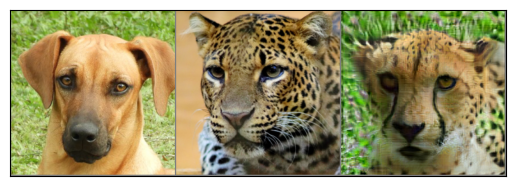
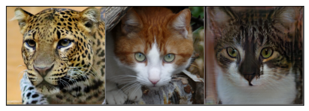

# StarGAN v2 + Modern GAN Baseline Loss

<p align="center">
  <a href="#about">About</a> •
  <a href="#overview">Overview</a> •
  <a href="#installation">Installation</a> •
  <a href="#how-to-use">How To Use</a> •
  <a href="#credits">Credits</a> •
  <a href="#license">License</a>
</p>

<div align="center">
  <a href="/LICENSE">
    
  </a>
</div>

## About

This repository contains an implementation of [StarGAN v2](https://arxiv.org/abs/1912.01865) with a modified loss inspired by ideas from the paper [The GAN is dead; long live the GAN! A Modern GAN Baseline](https://arxiv.org/abs/2501.05441). The project is built using pure PyTorch and aims to enhance GAN training stability and improve the quality of generated images through modern loss formulations.

## Examples
__dog + cheetah__



__cat + cheetah__




## 🔥 Overview  <span id="overview"></span>
This repository provides a lightweight, reference implementation of StarGAN v2 with an improved loss function.

### ✔ Implemented Features
- **Standalone Implementation**: A pure PyTorch reproduction of StarGAN v2 with modern loss modifications.
- **Multi-Domain Style Transfer**: Generate images across various styles and domains.
- **Enhanced Loss Function**: Incorporates ideas from *The GAN is dead; long live the GAN! A Modern GAN Baseline* for more stable training.
- **Complete Architecture**: Full implementation of the generator, discriminator, style encoder and mapping_network.
- **Reproducible Pipelines**: Scripts for data preprocessing, training, and evaluation with flexible configuration.

## Datasets & W&B Logs  <span id="datasets-and-wandb"></span>
Below are the Weights & Biases training logs for the datasets used during development:

- **Dataset: CelebA**
  [](https://api.wandb.ai/links/azrails-main/765m6k12)

- **Dataset: AFHQv2**
  [](https://api.wandb.ai/links/azrails-main/0mcpwghx)


## Installation

1. Install [Poetry](https://python-poetry.org/) (dependency management tool):
```bash
curl -sSL https://install.python-poetry.org | python3 -
```
2. Install dependencies
```bash
poetry install
```

## Usage
**Checkpoints link** [`dropbox`](https://www.dropbox.com/scl/fi/kubwfunvjimat9izxu7sy/checkpoints.zip?rlkey=9n50j647bk9j4ahrh9aa6ysta&st=ikrl33xi&dl=0)
For examples see [`notebook`](/notbooks/examples.ipynb)

## Credits

This repository is based on a heavily modified fork of [pytorch-template](https://github.com/victoresque/pytorch-template) repository.

## License

[](/LICENSE)
